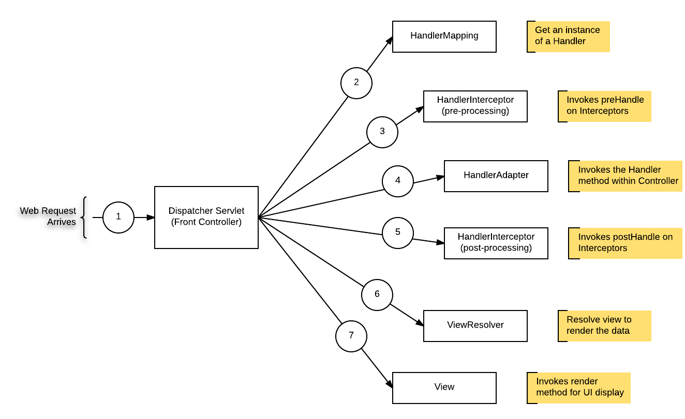
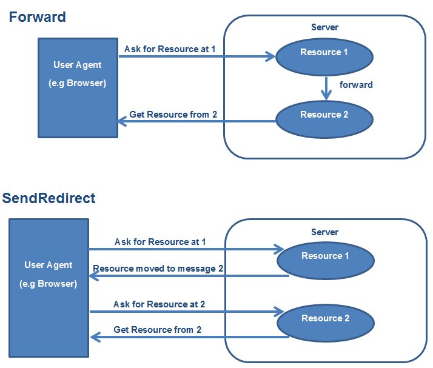
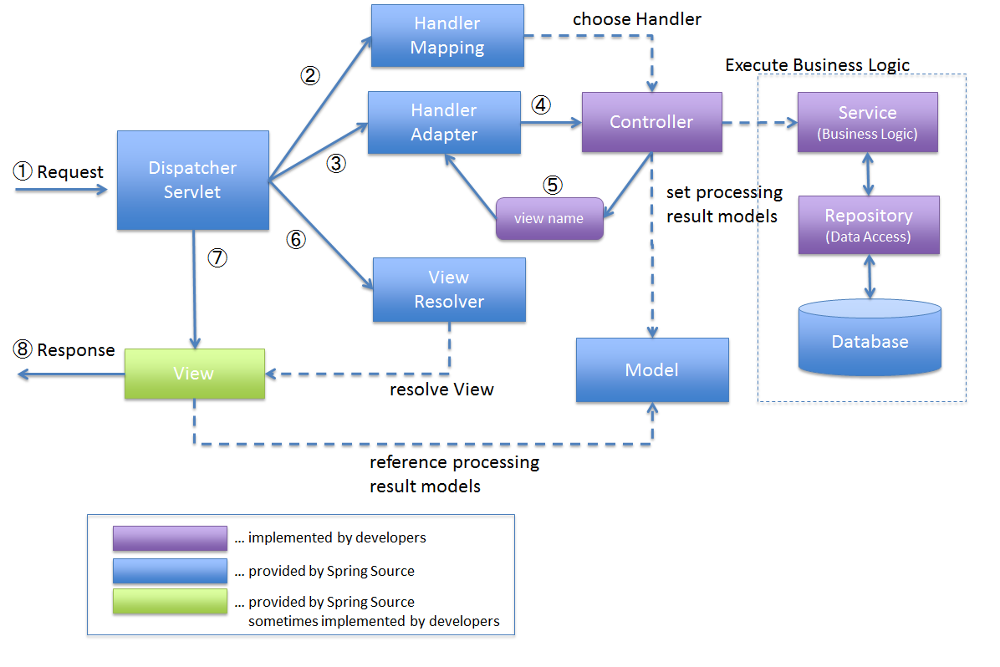

# Ch06. MVC 프레임워크 만들기
## 02. 프런트 컨트롤러 패턴 개념 소개

## 개념 정리
### 프런트 컨트롤러 패턴
- 모든 요청을 단일 handler(처리기)에서 처리하도록 하는 패턴
    - 중앙 집중식 요청 처리 매커니즘
- 스프링 웹 MVC 프레임워크의 DispatcherServlet(프런트 컨트롤러 역할)이 프런트 컨트롤러 패턴으로 구현되어 있음

    - 즉, 모든 요청을 받아서 DispatcherServlet 이 적절한 모듈에 위임

### Forward
- 서블릿에서 클라이언트(웹 브라우저)를 거치지 않고 바로 다른 서블릿(또는 JSP)에게 요청하는 방식
    - URL 주소가 변경되지 않음
- Forward 는 서버 내부에서 일어나는 요청이기 때문에 기존에 생성된 HttpServletRequest, HttpServletResponse 객체가 새롭게 생성되지 않음(기존 request/response 가 공유됨)
``` java
RequestDispatcher dispatcher = request.getRequestDispatcher("포워드할 서블릿 또는 JSP")
dispatcher.forward(request, response);
```

### Redirect
- 서블릿이 클라이언트(웹 브라우저)를 다시 거쳐 다른 서블릿(또는 JSP)에게 요청하는 방식
    - URL 주소가 변경됨
- Redirect 방식은 클라이언트(웹 브라우저)로부터 ``새로운 요청``이기 때문에 새로운 HttpServletRequest, HttpServletResponse 객체가 생성됨
- HttpServletResponse 객체의 sendRedirect() 이용
- Forward vs Redirect

    - forward: 기본 적으로 서버 내부에서 일어나기 때문에 기 생성된 request 를 전달함으로써 그대로 사용
    - redirect: 요청 인입 시 클라이언트(웹 브라우저)에게 응답 > 다시 '웹 브라우저'에서 서블릿/JSP 에게 요청하는 방식

## 실습 목표
- 모든 요청을 DispatcherServlet 이 받아서 적절한 컨트롤러에 작업을 위임한다.

<hr>

## 스프링 웹 MVC 프레임워크

  - 출처) https://terasolunaorg.github.io/guideline/1.0.1.RELEASE/en/Overview/SpringMVCOverview.html
  - reference) https://docs.spring.io/spring-framework/docs/3.2.x/spring-framework-reference/html/mvc.html
1) 최초 요청 url 을 dispatcherServlet 이 캐치!
2) url 에 맵핑되는 컨트롤러 정보 리턴!
3) Handler Adapter 가 컨트롤러를 실행!
4) 컨트롤러는 리턴 값으로 view-name 을 반환!
5) dispatcherServlet 은 view-name 을 가지고 View Resolver 를 통해서 view 객체를 리턴 받음!
6) View render 를 통해서 응답!

## 실습 목표!
- 애너테이션 기반 MVC 프레임워크를 만든다!
  - DispatcherServlet
  - AnnotationHandlerMapping (= HandlerMapping)
  - HandlerAdapter
  - ViewResolver